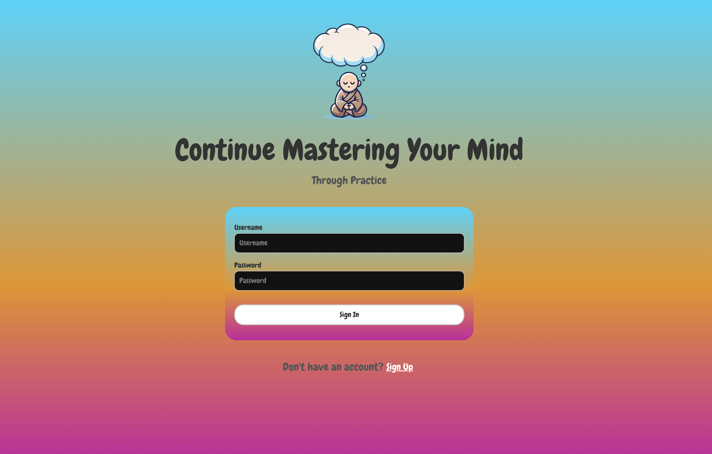
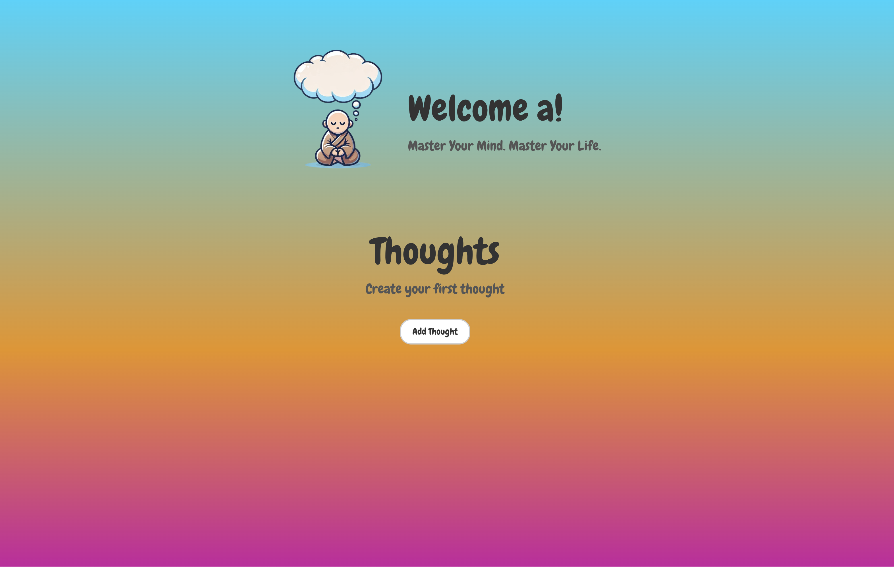
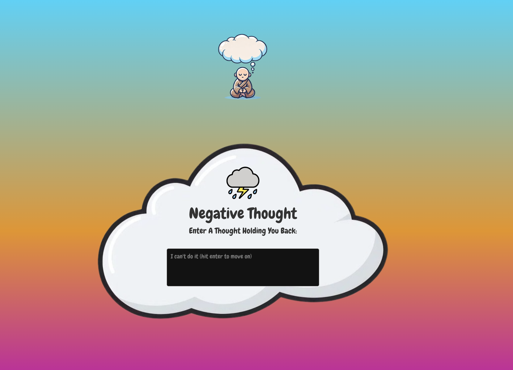
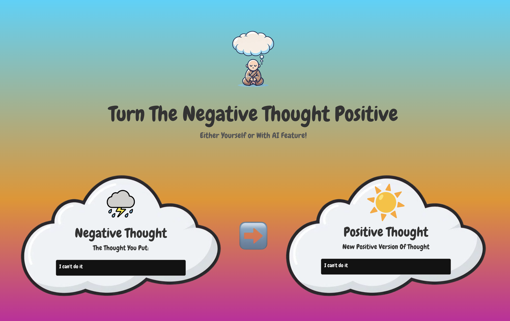

# Mind Mastery
A mental health app designed to change negative thoughts

## Description
This is a react project where users can change negative thoughts into positive ones using AI or themself. It is a CRUD app but has a practice feature that reinforces good thoughts while making bad thoughts weaker.

### Features:
- User authentication (signup/login) using JWT
- Create new thoughts (which contain a bad thought turned into a positive one)
- Manage those thoughts (edit or delete them) 
- Practice feature that reinforces the new positive thought

### Features Added:
- User authentication (signup/login) using JWT
- Create thought screens
- Backend routes for retrieving users and thoughts 

### Features Needed:
- Save thoughts to database for users to retrieve and display
- OpenAI chat api for assistance in creating positive thoughts

## Demo

### Landing Page

### Login Page

### Home Page

### Creating Negative Thought Page

### Changing Negative Thought Into Positive
