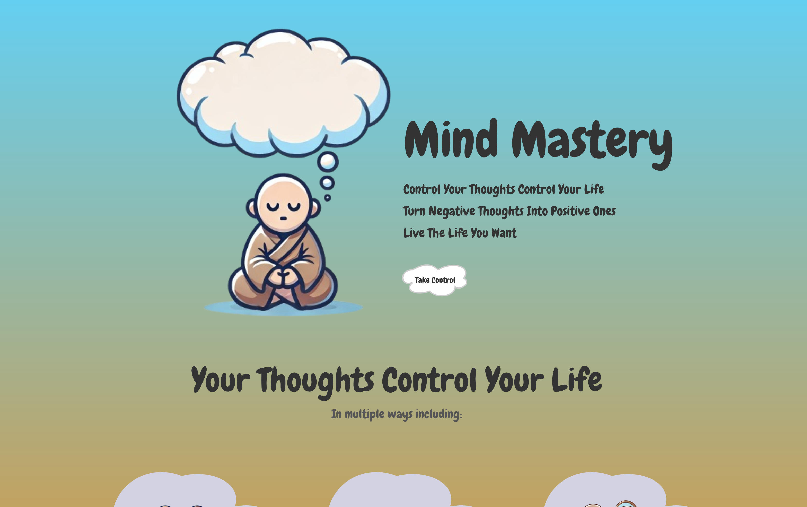

# Mindestry (Mind + Mastery)
This is a react project where users can change negative thoughts into positive ones using AI or themself. It is a CRUD app with a practice feature that reinforces good thoughts while making bad thoughts weaker, through animations to make confronting our thoughts holding us back a bit easier. Also leveraging OpenAIs api to assist people in changing their negative thoughts into positive ones.

### Features:
- User authentication (signup/login) using JWT
- Create new thoughts (which contain a bad thought turned into a positive one)
- Manage those thoughts (edit or delete them) 
- Practice feature that reinforces the new positive thought (animations for better user experience)
- AI features (with OpeanAI api) to assist in creating positive thoughts

### Tech Stack:
- ReactJS
- JavaScript/HTML/CSS
- MongoDB
- NodeJS (Express JS framework)
- Openai API

## Demo

### Landing Page

### Login Page

### Home Page

### Creating Negative Thought Page

### Changing Negative Thought Into Positive

