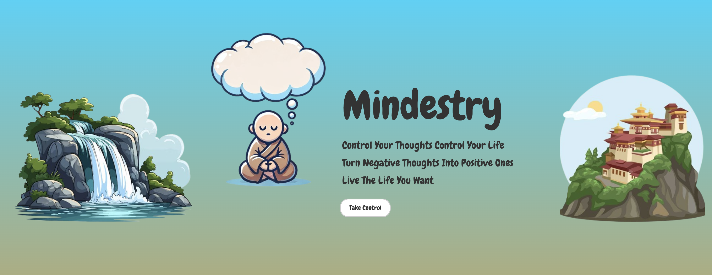
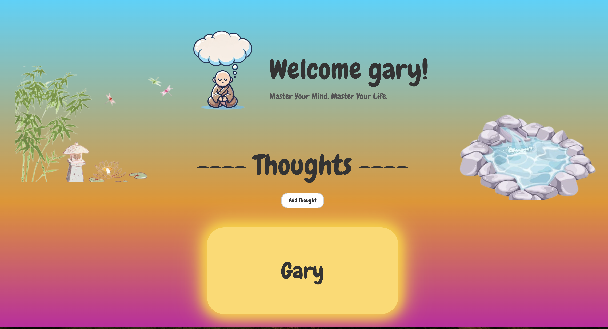
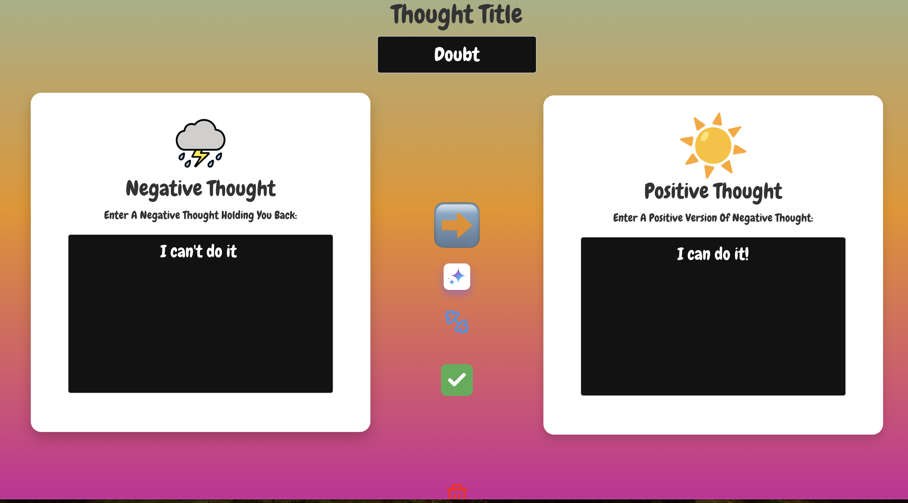

# 🧠 Mindestry – Control Your Thoughts, Control Your Life
A mindfulness-based web app that helps users transform negative thoughts into positive ones through guided exercises and self-reflection.

# Try it out here: https://mindestry.onrender.com/

## 🌟 Screenshots
### 🖼️ Landing Page

### 🏠 Home Page

### 🎯 Thought Transformation

## 🚀 Tech Stack
- **Frontend**: React, HTML/CSS, JavaScript
- **Backend**: Node.js, Express.js
- **Database**: MongoDB Atlas
- **Hosting**: Render
- **Auth**: JWT Authentication
- **Build**: Vite

## ✨ Features
✅ Convert negative thoughts into positive ones  
✅ Interactive thought transformation exercises  
✅ Secure authentication with JWT  
✅ AI-powered thought suggestions 
